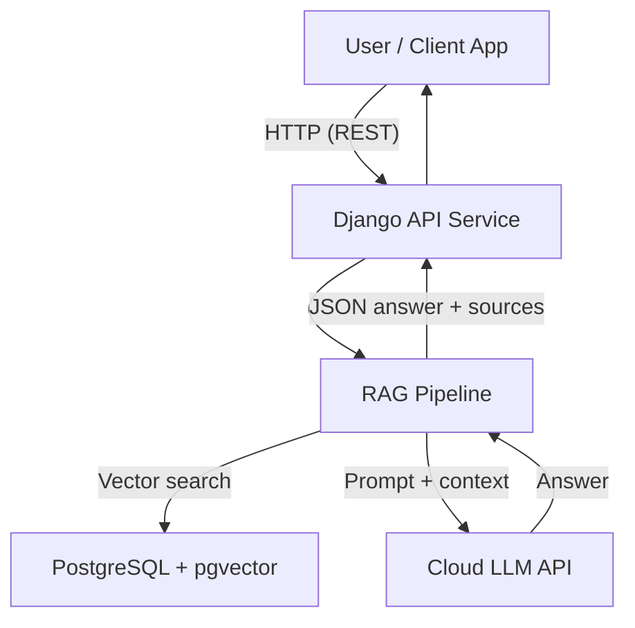
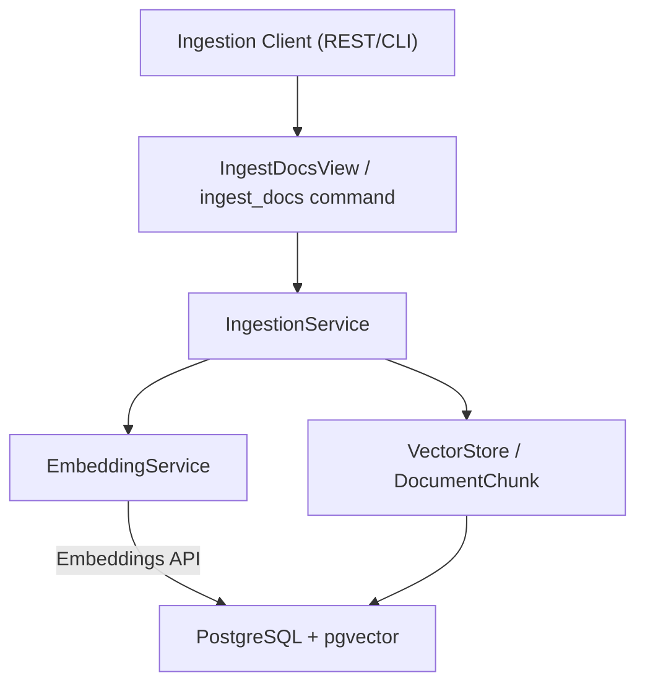
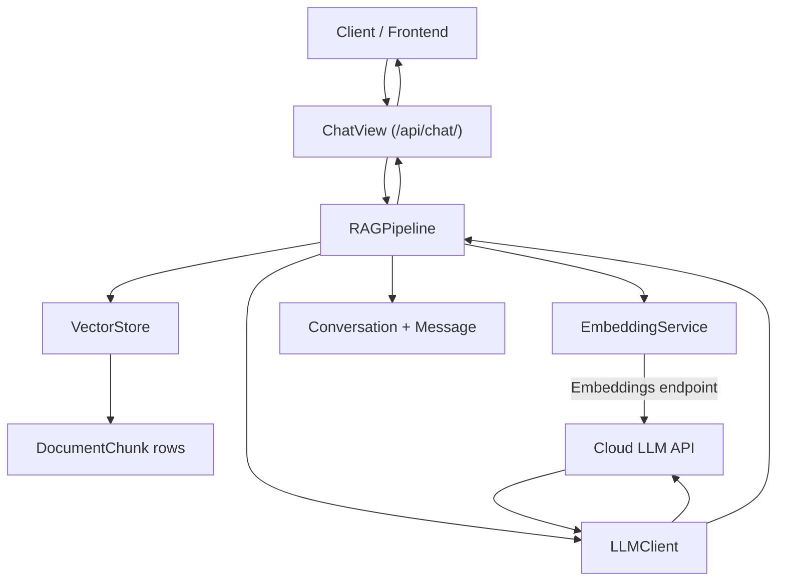

## 1. High-Level Overview

This project is a **RAG (Retrieval-Augmented Generation) API Support Chatbot**. It helps developers and support engineers understand and use APIs correctly by:

- Ingesting API documentation, examples, and FAQs.
- Storing semantic embeddings of those documents in a **PostgreSQL + pgvector** vector store.
- Using a **cloud LLM** (OpenAI-compatible API) to generate answers grounded in the retrieved documentation.
- Exposing a **JSON API** for chat and ingestion, which can be consumed by any frontend (web, mobile, support tools, etc.).

At a high level:

- Users (or client apps) call the Django REST API.
- The API runs a RAG pipeline: embed query → retrieve similar chunks → build a context-rich prompt → call the LLM → return the answer plus citations to the source documents.
- All services are containerized with Docker and orchestrated via `docker-compose`.

### 1.1 High-Level Architecture Diagram

## 2. Components

### 2.1 Django API Service (`backend/`)

- **Framework**: Django + Django REST Framework.
- **Main responsibilities**:
  - Expose REST endpoints:
    - `POST /api/chat/` – ask questions and get RAG-based answers.
    - `POST /api/docs/ingest/` – ingest new API documentation.
  - Manage persistence:
    - `Document`, `DocumentChunk` for documentation and embeddings.
    - `Conversation`, `Message` for chat history.
  - Orchestrate the RAG pipeline via dedicated service classes.

### 2.2 Vector Store (PostgreSQL + pgvector)

- Runs in a dedicated Docker service (`db` in `docker-compose.yml`).
- Stores:
  - Documents and metadata.
  - Document chunks and their embedding vectors in a `VectorField` (pgvector).
- Provides **approximate similarity search** by cosine distance over vectors.

### 2.3 Cloud LLM Service

- Any **OpenAI-compatible chat completion + embeddings API**:
  - Configured via environment variables:
    - `LLM_API_BASE_URL`
    - `LLM_API_KEY`
    - `LLM_MODEL_NAME`
    - `EMBEDDING_MODEL_NAME`
- Used for:
  - Computing **embeddings** for documents and user queries.
  - Generating **answers** to user questions based on retrieved context.

### 2.4 Optional Background Ingestion

- For simplicity, ingestion currently runs synchronously:
  - Via `POST /api/docs/ingest/`.
  - Or via `python manage.py ingest_docs ...`.
- It could later be moved to a queue/worker system (e.g. Celery) if ingestion volumes grow.

## 3. Data Flow Scenarios

### 3.1 Document Ingestion Flow

Goal: take raw API documentation and turn it into retrievable, vectorized chunks.

Steps:

1. **Input**:
   - REST call to `POST /api/docs/ingest/` with payload:
     - `source_name`: a label for this set of docs (e.g. `"Payments API v1"`).
     - `docs`: list of `{ "title": str, "content": str }`.
   - Or CLI: `python manage.py ingest_docs <source_name> <json_path>`.
2. **Django view / command**:
   - Validates input.
   - Instantiates `IngestionService`.
3. **IngestionService** (`api_support/services/ingestion.py`):
   - Creates a `Document` row for each item.
   - Runs **simple chunking** (`_simple_chunk`) on `content`:
     - Splits into paragraphs.
     - Groups paragraphs into chunks of ~`max_tokens_approx`.
   - For each chunk:
     - Calls `EmbeddingService.get_embedding(chunk_text)` to get a vector.
     - Prepares a record with `(document_id, chunk_index, content, metadata, embedding)`.
   - Calls `VectorStore.upsert_chunks` to bulk insert into `DocumentChunk` with a `VectorField`.
4. **Storage**:
   - Postgres stores:
     - `Document` row per doc.
     - `DocumentChunk` row per chunk, including the embedding.
5. **Output**:
   - REST endpoint returns summaries:
     - For each doc: `{"document_id": ..., "chunks_created": ...}`.
   - CLI logs similar information.

Mermaid data flow:

### 3.2 Question Answering Flow

Goal: answer user questions about how to use an API, using ingested docs as context.

Steps:

1. **Input**:
   - REST call to `POST /api/chat/` with payload:
     - `query`: the user’s question (e.g. `"How do I authenticate to this API?"`).
     - Optional `conversation_id` to continue an existing conversation.
2. **ChatView** (`api_support/views.py`):
   - Validates request (`ChatRequestSerializer`).
   - Instantiates `RAGPipeline`.
   - Calls `pipeline.answer(question, conversation_id)`.
3. **RAGPipeline.answer**:
   - Fetches or creates a `Conversation`.
   - Uses `EmbeddingService.get_embedding(question)` to get a query vector.
   - Uses `VectorStore.search(embedding, top_k)` to retrieve top similar `DocumentChunk`s:
     - Orders by `CosineDistance("embedding", embedding)`.
   - Builds a **prompt**:
     - System message: instructs the model to be an API support assistant and to rely on context.
     - User message: composed of:
       - Concatenated context snippets from retrieved chunks (with document titles).
       - The actual user question.
   - Sends messages to `LLMClient.chat(messages)` to get the answer text.
   - Appends `Message` rows for the user question and assistant answer.
   - Packages the answer and sources (doc IDs, titles, chunk indices, snippets).
4. **Output**:
   - `ChatView` serializes the response via `ChatResponseSerializer`:
     - `answer`: LLM text.
     - `sources`: list of citations.
     - `conversation_id`: for future follow-ups.

Mermaid data flow:

### 3.3 Conversation Continuation

- When a `conversation_id` is provided:
  - `RAGPipeline` loads all `Message` rows for that `Conversation`.
  - Those previous messages are appended (in order) to the prompt before the new user query.
- This lets the assistant keep context of prior questions and answers within the same conversation.

## 4. Detailed Module Design

### 4.1 Models (`backend/api_support/models.py`)

- **`Document`**
  - Fields:
    - `title`: human-readable title for the document.
    - `source_name`: grouping label (e.g. `"Payments API"`).
    - `created_at`: timestamp.
- **`DocumentChunk`**
  - Fields:
    - `document`: FK to `Document`.
    - `chunk_index`: order index within the document.
    - `content`: text of the chunk.
    - `metadata`: JSON (e.g. section headings, tags).
    - `embedding`: `VectorField(dimensions=1536)` from `pgvector.django`.
    - `created_at`: timestamp.
  - Indexes:
    - `document, chunk_index` for ordering.
- **`Conversation`**
  - Fields:
    - `title`: optional short label (defaults to truncated first query).
    - `created_at`: timestamp.
- **`Message`**
  - Fields:
    - `conversation`: FK to `Conversation`.
    - `role`: `"user"` or `"assistant"`.
    - `content`: message text.
    - `created_at`: timestamp.
  - Meta:
    - Ordered by `created_at`.

### 4.2 Services

- **`EmbeddingService` (`services/embedding.py`)**
  - Encapsulates the embeddings HTTP API.
  - Uses `LLM_API_BASE_URL`, `LLM_API_KEY`, `EMBEDDING_MODEL_NAME`.
  - Method:
    - `get_embedding(text: str) -> list[float]`
      - Calls `POST /embeddings` and returns `data[0].embedding`.
- **`LLMClient` (`services/llm_client.py`)**
  - Encapsulates chat completion.
  - Uses `LLM_API_BASE_URL`, `LLM_API_KEY`, `LLM_MODEL_NAME`.
  - Method:
    - `chat(messages: list[dict], temperature: float = 0.2) -> str`
      - Calls `POST /chat/completions` and returns the assistant message content.
- **`VectorStore` (`services/vector_store.py`)**
  - Abstracts Postgres+pgvector access.
  - Methods:
    - `upsert_chunks(chunks)`:
      - Bulk inserts `DocumentChunk` rows.
    - `search(embedding, top_k)`:
      - Orders `DocumentChunk` by `CosineDistance("embedding", embedding)` and returns top `k`.
- **`RAGPipeline` (`services/rag_pipeline.py`)**
  - Central orchestration for question answering.
  - Responsibilities:
    - Manage conversation lifecycle.
    - Compute query embedding.
    - Retrieve similar chunks.
    - Build prompt and call LLM.
    - Save messages and return structured response (`RAGResponse` dataclass).
- **`IngestionService` (`services/ingestion.py`)**
  - Orchestrates document ingestion.
  - Responsibilities:
    - Chunk raw text.
    - Compute embeddings per chunk.
    - Upsert into vector store.
    - Return summaries (`IngestedDocumentSummary`).

### 4.3 API Layer

- **Serializers** (`serializers.py`):
  - `ChatRequestSerializer`, `ChatResponseSerializer` for `/api/chat/`.
  - `IngestRequestSerializer`, `IngestResponseSerializer` for `/api/docs/ingest/`.
- **Views** (`views.py`):
  - `ChatView`:
    - Validates input.
    - Delegates to `RAGPipeline`.
    - Returns JSON answer and sources.
  - `IngestDocsView`:
    - Validates input.
    - Delegates to `IngestionService`.
    - Returns summaries.
- **URLs** (`api_support/urls.py` and `config/urls.py`):
  - Mounts these views under `/api/`.

### 4.4 Management Commands

- `ingest_docs` (`management/commands/ingest_docs.py`):
  - CLI tool to ingest documents from a JSON file.
  - Good for bulk loading large doc sets or during deployment.

## 5. Operational Concerns

### 5.1 Configuration

- All sensitive or environment-specific values are controlled via `.env`:
  - Django:
    - `DJANGO_SECRET_KEY`, `DJANGO_DEBUG`, `DJANGO_ALLOWED_HOSTS`.
  - Database:
    - `DB_NAME`, `DB_USER`, `DB_PASSWORD`, `DB_HOST`, `DB_PORT`.
  - LLM:
    - `LLM_API_KEY`, `LLM_API_BASE_URL`, `LLM_MODEL_NAME`, `EMBEDDING_MODEL_NAME`.

### 5.2 Logging and Error Handling

- LLM / embedding HTTP calls use `requests` and raise exceptions on HTTP errors:
  - In production, you can wrap these calls in try/except and map them to user-facing error messages or retry logic.
- Django’s default logging can be extended in `settings.py` for:
  - Request logs.
  - LLM latency and error tracking.
  - Vector search performance.

### 5.3 Rate Limiting and Quotas

- LLM providers often enforce rate limits.
- Strategies (not yet implemented but supported by design):
  - Centralize all LLM calls in `LLMClient` and `EmbeddingService` to make adding retry/backoff easier.
  - Add simple in-memory or Redis-based rate limiting before invoking the LLM.

### 5.4 Security

- Keep `.env` out of version control; only use `env.example` as a template.
- Use HTTPS and proper authentication/authorization in front of the Django API in production (e.g. via an API gateway or reverse proxy).
- Ensure the LLM prompt does not include secrets from logs or internal-only docs unless intended.

## 6. Extensibility

### 6.1 Swapping LLM Providers

- Because all calls are concentrated in `EmbeddingService` and `LLMClient`, you can:
  - Change `LLM_API_BASE_URL` to point to Azure OpenAI, a proxy, or another provider with an OpenAI-compatible interface.
  - Or rewrite these two classes for a completely different API shape while keeping the rest of the code unchanged.

### 6.2 Swapping Vector Databases

- Current implementation uses Django + pgvector.
- To move to a dedicated vector DB (e.g. Qdrant, Pinecone, Weaviate):
  - Implement a new `VectorStore` class (same `upsert_chunks`/`search` interface).
  - Update `RAGPipeline` and `IngestionService` to use that new implementation (e.g. via dependency injection or settings-based factory).

### 6.3 Adding New Channels

- Since the primary interface is a REST API, new channels can be implemented by:
  - Building thin adapters (e.g. Slack bot, web widget, CLI) that call:
    - `POST /api/chat/` for questions.
    - Optionally `POST /api/docs/ingest/` to push new knowledge.

### 6.4 Improving Chunking and Retrieval

- The current chunking is deliberately simple; for better quality:
  - Use token-aware chunking based on model tokenizer.
  - Store additional metadata (e.g. section headings, tags) and filter retrieval by metadata.
  - Introduce hybrid search (keyword + vector).

